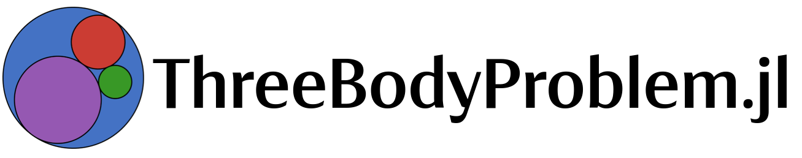

[](https://jared711.github.io/ThreeBodyProblem.jl/)
[](https://travis-ci.com/jared711/ThreeBodyProblem.jl)
[](https://ci.appveyor.com/project/jared711/ThreeBodyProblem-jl)
[](https://codecov.io/gh/jared711/ThreeBodyProblem.jl)

An astrodynamics package for working in the three body problem.

## Requirements
Julia 1.6+

## Installation
ThreebodyProblem.jl is not on the General Registry yet, so you must use Git to clone it to your computer.
```shell
git clone https://github.com/jared711/ThreeBodyProblem.jl.git
```
Then, you can add it to your Julia package environment by running the following from a Julia REPL.
```julia
using Pkg
Pkg.add("[local path]/ThreeBodyProblem.jl")
```

## Examples
Examples are found [here](https://github.com/jared711/ThreeBodyProblem.jl/tree/master/example)

## Jupyter Notebooks
To run Jupyter notebooks, you need to have the IJulia package downloaded.
```julia
using Pkg
Pkg.add("IJulia")
```
Then run the following from your desired working directory
```julia
using IJulia
notebook(dir=".",detached=true)
```

## Documentation
Documentation is found [here](https://jared711.github.io/ThreeBodyProblem.jl)
